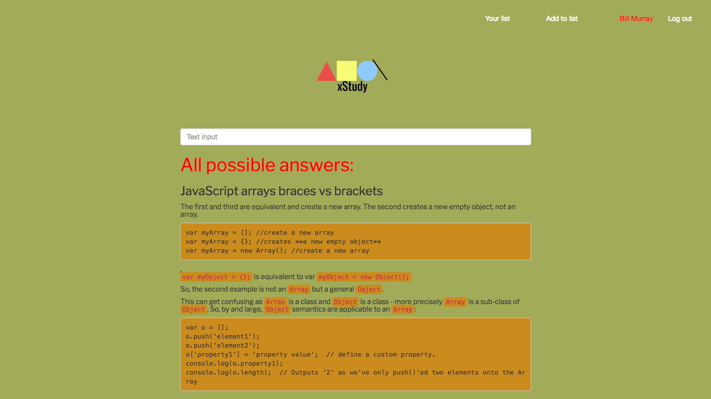

# xStudy

Prototype of Stackoverflow

## Built With

* [Knex.js](http://knexjs.org/) - The web framework used
* [Semantic UI](https://semantic-ui.com/) - CSS
* [Express.js](https://expressjs.com/) - Back End Framework

## Authors

* **Artur Lan** - *Initial work* - [arturlan.in](http://www.arturlan.in/)

## Acknowledgments

* Hat tip to anyone who's code was used
* Inspiration
* etc

